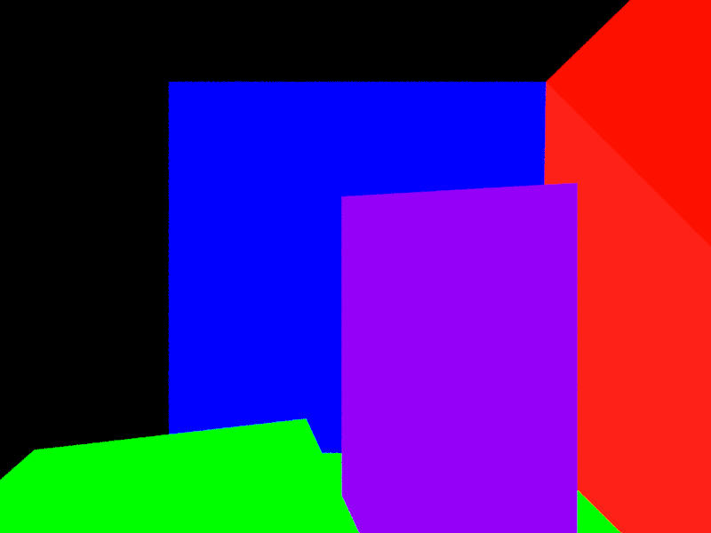
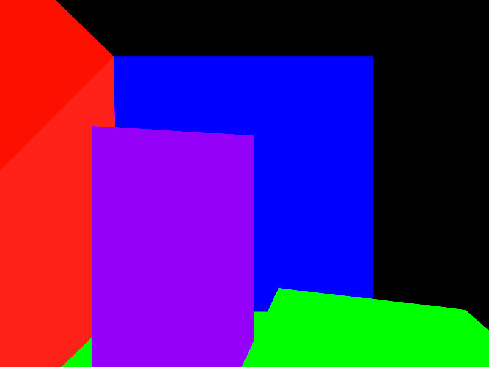

# Raytracing
There is a lot from the series of books: Raytracing in a weekend/in a week/for the rest of your life

## Dragon
Renderered in 1.5secs, 5samples per pixel
|              Current result               |               Normals               |               Albedo               |
| :---------------------------------------: | :---------------------------------: | :--------------------------------: |
|  |  |  |

Renderered in 6.5secs, 20samples per pixel
|              Current result               |               Normals               |               Albedo               |
| :---------------------------------------: | :---------------------------------: | :--------------------------------: |
|  |  |  |

Renderered in 33secs, 100samples per pixel
|              Current result               |               Normals               |               Albedo               |
| :---------------------------------------: | :---------------------------------: | :--------------------------------: |
|  |  |  |

## Cornell-box
Renderered in 0.9secs, 5samples per pixel
|              Current result               |               Normals               |               Albedo               |
| :---------------------------------------: | :---------------------------------: | :--------------------------------: |
|  |  |  |

Renderered in 3.5secs, 20samples per pixel
|              Current result               |               Normals               |               Albedo               |
| :---------------------------------------: | :---------------------------------: | :--------------------------------: |
|  |  |  |

Renderered in 19.5secs, 100samples per pixel
|              Current result               |               Normals               |               Albedo               |
| :---------------------------------------: | :---------------------------------: | :--------------------------------: |
|  |  |  |
