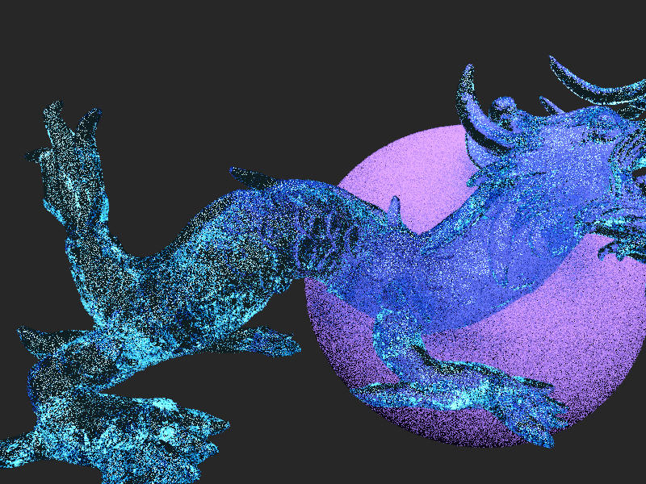
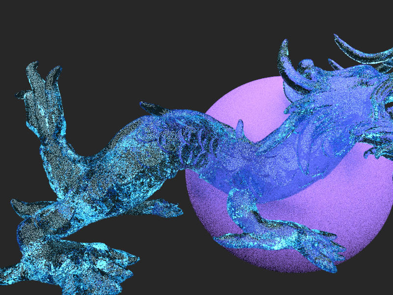
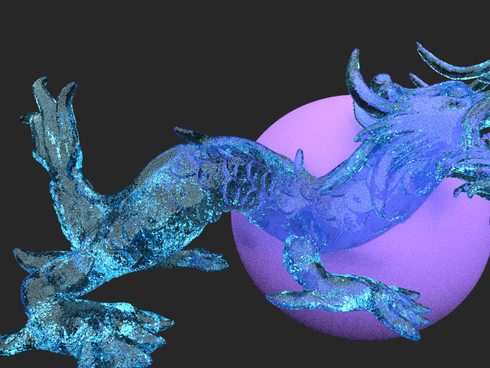
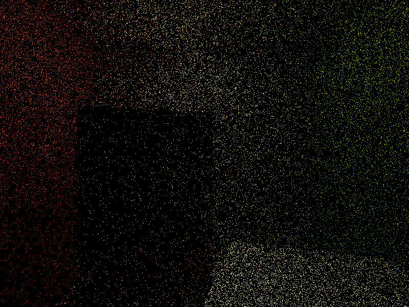
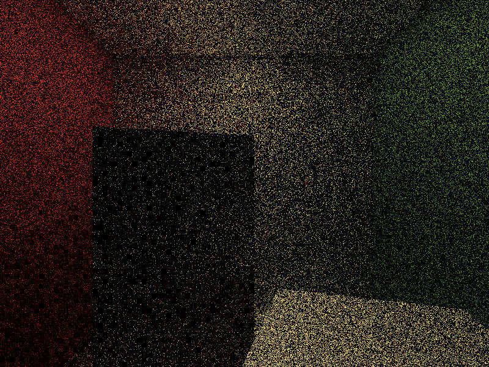
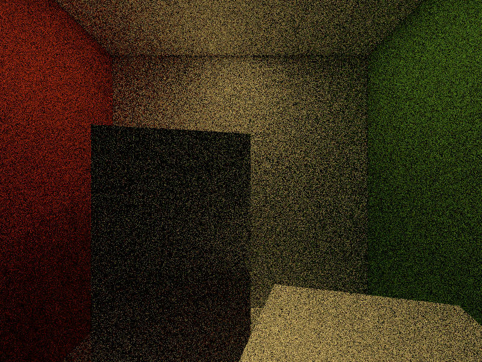

# Raytracing

## Dragon

Renderered in 400ms, 5samples per pixel
  

Renderered in 1.5 secs, 20samples per pixel

Renderered in 7 secs, 100samples per pixel

## Cornell-box
Renderered in 450msecs, 5samples per pixel

Renderered in 1.7secs, 20samples per pixel

Renderered in 8.5secs, 100samples per pixel

