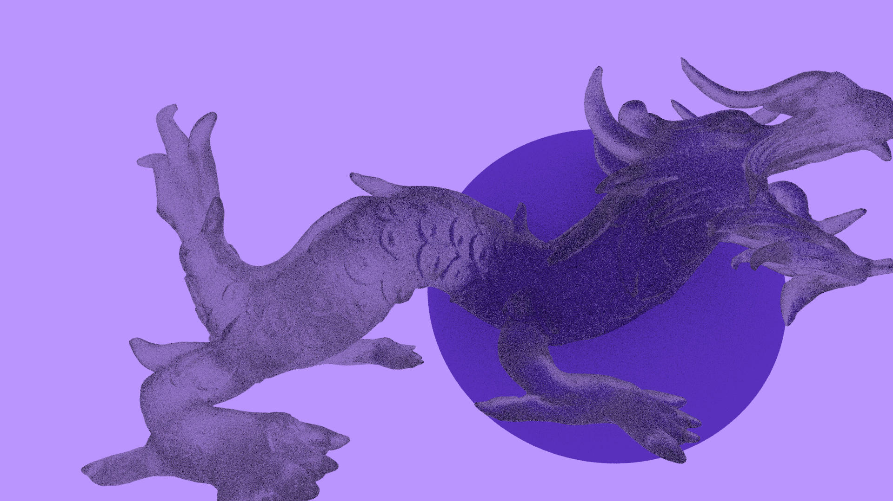
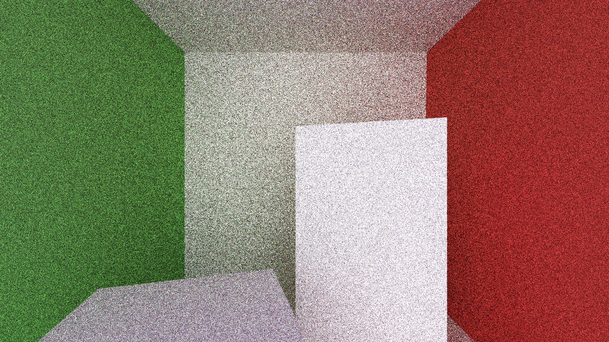
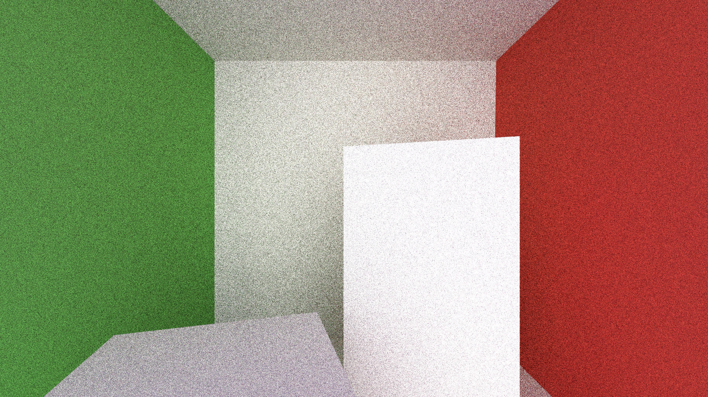
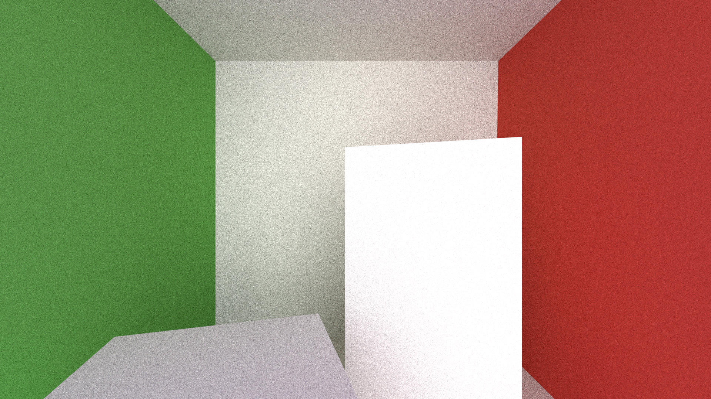

# Raytracing

## Dragon

Renderered in 1.5s, 5samples per pixel, 1920x1080
  

Renderered in 6.7s, 20samples per pixel, 1920x1080

Renderered in 38.5s, 100samples per pixel, 1920x1080

## Cornell-box
Renderered in 4.9s, 5samples per pixel, 1920x1080

Renderered in 16.3s, 20samples per pixel, 1920x1080

Renderered in 1m31s, 100samples per pixel, 1920x1080

